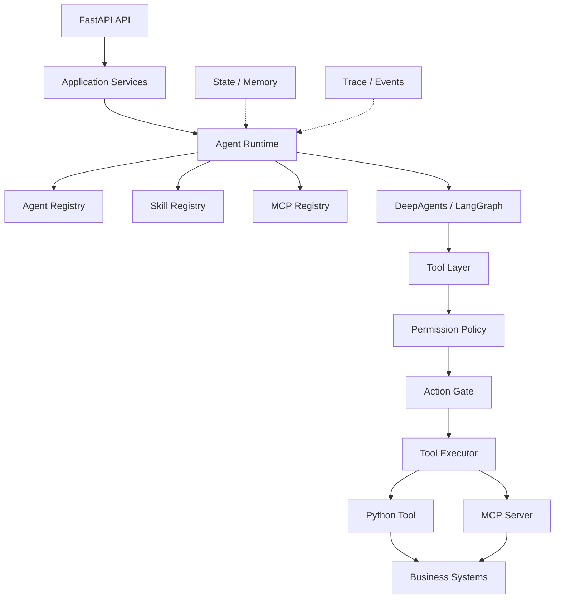
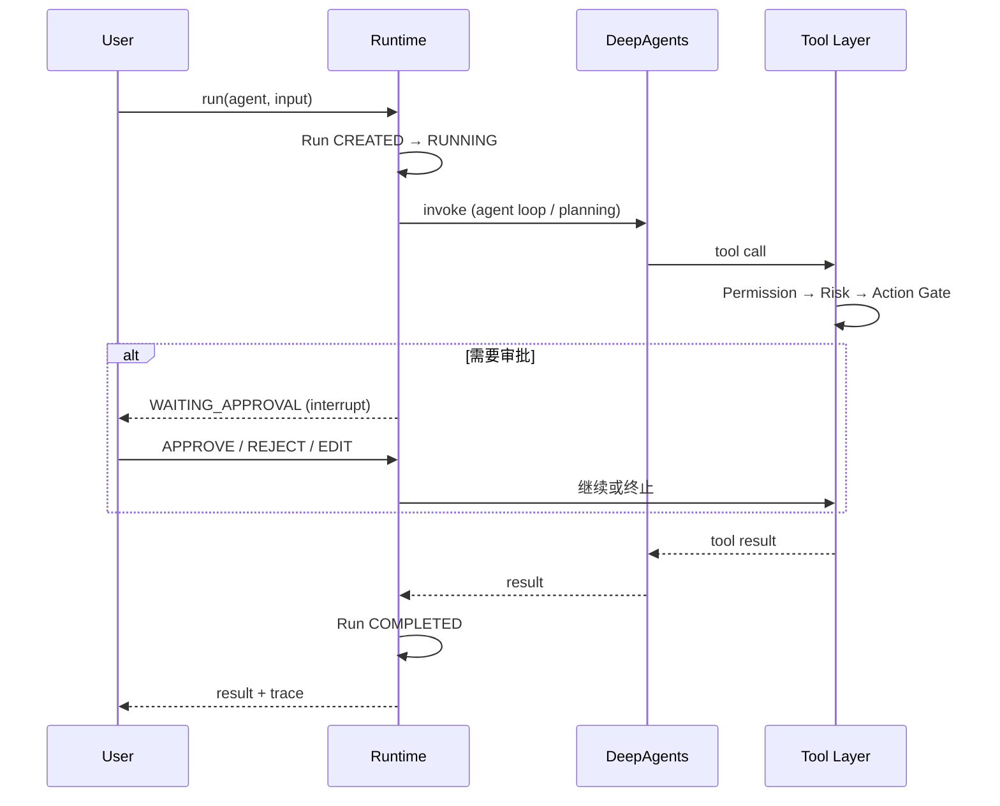
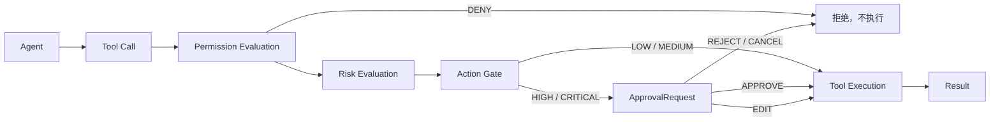

# Agent Core 架构

> 状态：全部核心 Phase 已落地（Domain / Registry / Runtime / Gate / 事件流 / MCP / HTTP API / CLI），
> 并完成 Runtime Hardening 1.0（边界）与 2.0（R20–R24，见下方"新增层"）。

## 分层

```text
┌─────────────────────────────────────────────┐
│  API (FastAPI)            — Phase 7         │  HTTP → Schema → Application Service
├─────────────────────────────────────────────┤
│  Application             — Phase 7          │  业务编排（RunService / ActionService …）
├─────────────────────────────────────────────┤
│  Agent Runtime           — Phase 3          │  统一生命周期、执行编排
├─────────────────────────────────────────────┤
│  Registries              — Phase 2          │  Agent / Tool / Skill / MCP
├─────────────────────────────────────────────┤
│  Permission → Action Gate — Phase 4         │  安全边界，工具执行前强制经过
├─────────────────────────────────────────────┤
│  Infrastructure                             │  DeepAgents / LangGraph / MCP SDK / API
└─────────────────────────────────────────────┘
        ▲
        │ 依赖倒置：Domain 定义接口，Infrastructure 实现
┌─────────────────────────────────────────────┐
│  Domain（已落地）                            │  纯数据 + 规则，零第三方框架依赖
│  agent / task / action / tool /             │
│  permission / skill / mcp / trace           │
├─────────────────────────────────────────────┤
│  横切（已落地）                              │
│  config（环境变量）errors（统一异常）        │
│  observability（logger / Tracer / EventBus） │
└─────────────────────────────────────────────┘
```

依赖方向严格单向：`API → Application → Domain ← Infrastructure`。Domain 不允许 import FastAPI、LangChain、DeepAgents、MCP SDK、数据库驱动。

## 系统架构图



## Agent 执行流程



## Tool 调用链（含 HITL）



## 统一 Run 生命周期

```text
CREATED → RUNNING ⇄ WAITING_APPROVAL → COMPLETED
                 ↘ FAILED / CANCELLED / TIMEOUT（终态）
```

状态机在 `domain/task.py` 中用显式转移表实现，非法转移抛 `StateError`。
（`PLANNING` 曾定义但无人进入，已删除——计划改由 R21 的 Task State 显式表达。）

## Runtime Hardening 2.0 新增层（R20–R24）

```mermaid
flowchart TB
    CTRL[Control Plane<br/>Agent / Skill / MCP Binding] --> RES[Capability Resolver<br/>R22：工具可调用性唯一来源]
    RES --> RT[Agent Runtime]
    RT --> CTX[Context Builder<br/>R20：有序/有预算/可解释]
    RT --> TS[Task State<br/>R21：事件投影的显式进度]
    RT --> EXEC[Execution Policy<br/>R24：文件/网络/环境/资源]
    RT --> MEM[Memory + Governance<br/>R23：(scope, owner) 读写策略]
    CTX --> LLM[LLM]
    TS -.回注.-> CTX
    MEM -.检索.-> CTX
    STUB[工具分层披露<br/>R20§10：冷工具 stub 广告] -.-> LLM
```

- **R20 Context（`src/agent_core/context/`）**：system prompt 不再字符串拼接，而是
  **有序、有预算、可解释**的 section 列表（base/autonomy/environment/task_state/
  memory/lesson）；每次 run 记 `metadata.context_sections`。
  **工具 schema 治理**（§10）：先按上限**压缩**描述，再把**冷工具**（默认 MCP）以
  「名字 + 一句摘要」的 stub 广告，**调用时**在 `awrap_tool_call` 里拦截（真实 schema
  校验前）→ 激活 → 合成 ToolMessage 让模型重试 → 下一轮带全量 schema 执行。广告成本
  实测 5262 → 2844 token。依据是"**执行集 > 广告集**"：工具全部注册进图，中间件只控制广告集。
- **R21 Task State（`src/agent_core/task_state/`）**：把"任务到哪了"从聊天历史里拆出来，
  由 trace 事件**投影**（纯 reducer）出 status/failures/artifacts/activity，plan 由
  agent 用 `update_plan` 声明；落 `registry_items(kind=task_state)`，重启修正；`GET /tasks/{id}/state`。
- **R22 Capability Resolver（`src/agent_core/capabilities/`）**：`ActionPolicy`、builder、
  控制台三方读同一个 `EffectiveCapabilitySet`（绑定 ∩ 技能 allowed_tools ∩ 有 handler ∩
  权限规则 ∩ 风险阈值），展示与强制不再可能分叉。
- **R23 Memory Governance（`memory/policy.py`）**：记忆身份 = `(scope, scope_id)`；
  agent 可写 USER/PROJECT/AGENT，**不能写 ORG**，写 PROJECT 必须绑定项目；读只含本轮语境。
- **R24 Execution / Network Policy（`src/agent_core/execution/`）**：显式
  `ExecutionPolicy`（文件/网络/环境/超时/资源），host 模式下网络 `enforced=false` **如实标注**；
  `AGENT_CORE_SANDBOX_NETWORK=host|private|none`、`_NETWORK_ALLOW`、`_ENV_ALLOW`。

## 关键决策记录

- **复用 DeepAgents**：agent loop、subagents、skills 加载、HITL interrupt/checkpoint 全部复用；Agent Core 只做 Registry、Policy、Gate、Trace、API。
- **错误模型**：所有异常继承 `AgentError`，携带 `retryable` 标记；工具层不向 Agent 泄漏原始 Python 异常。API 层一次性把异常映射为 `{"error": {code, message, retryable, details}}`。
- **安全**：MCP 凭据只存 `auth_ref` 引用，连接时经 `CredentialResolver` 从环境解析；模型 API key 由 provider SDK 标准环境变量管理。所有工具（本地 Python 与 MCP）都经同一条 Permission → Action Gate 链路。
- **传输层极薄**：`AgentCoreService` 是 API/CLI 共用的唯一用例入口；`create_app` 支持注入自定义 service，路由无状态。
- **第一版不引入**：Kafka / Redis / PostgreSQL / 向量库 / 微服务，单进程可运行。
- **持久化（Phase 16）**：可选 SQLite（标准库 `sqlite3`，WAL）作为**写穿透镜像**——内存 dict 始终是读侧唯一来源，`AGENT_CORE_DATABASE_URL` 设置后注册中心/Run/审批/Trace 事件落库并在启动时恢复；跨重启的执行恢复（LangGraph checkpointer）仍属远期。
- **自治层（Phase 17）**：预算/循环检测/求助/自检全部是声明式的 `AgentSpec.autonomy` 纯数据 + 运行时三个挂钩点——中间件（Budget，复用原生 `jump_to end` 收尾模式）、Action Gate（LoopGuard 与 `request_help`，gate 仍是工具执行的唯一通道）、Run 收尾回路（verification 嵌套 judge run）。治理动作优先"软反馈给模型"，只在确认无进展时升级人工（`NEEDS_INPUT`），审批答复经同一 ApprovalManager 通道回流。
- **Sandbox（Phase 21）**：`run_code` 支持 podman 后端（`AGENT_CORE_SANDBOX=podman`）——rootless 容器仅挂载 workspace、资源受限、代理透传，宿主机密钥与文件系统不可达；workspace 是 agent 与宿主机的唯一交换点。自定义中间件必须同时实现 sync 与 async 钩子（运行时全 async，LangChain 无回退）。已知缺口：deepagents 文件工具（write_file 等）未纳入 Gate/事件系统，按路径约束在 workspace 内，远期收编到 SandboxBackendProtocol。
