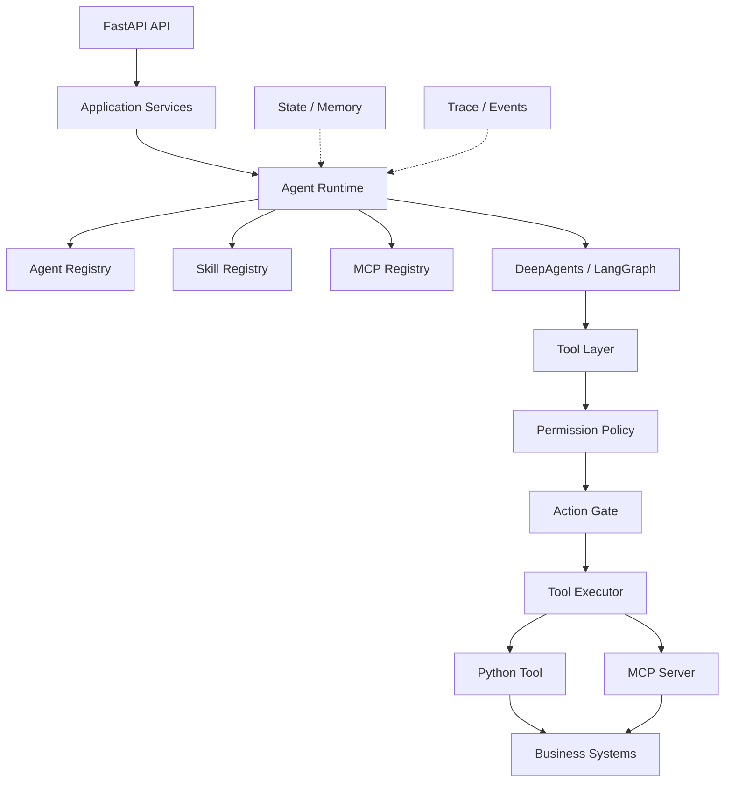
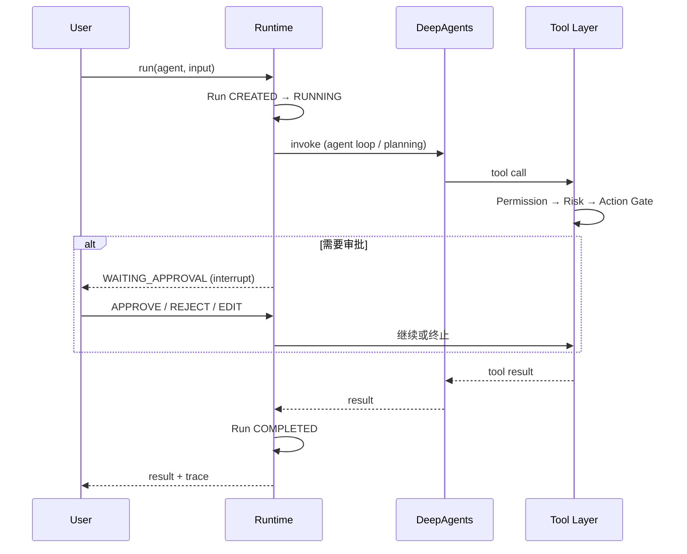
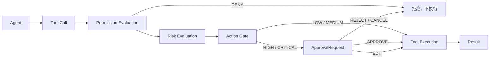

# Agent Core 架构

> 状态：全部核心 Phase 已落地（Domain / Registry / Runtime / Gate / 事件流 / MCP / HTTP API / CLI）。

## 分层

```text
┌─────────────────────────────────────────────┐
│  API (FastAPI)            — Phase 7         │  HTTP → Schema → Application Service
├─────────────────────────────────────────────┤
│  Application             — Phase 7          │  业务编排（RunService / ActionService …）
├─────────────────────────────────────────────┤
│  Agent Runtime           — Phase 3          │  统一生命周期、执行编排
├─────────────────────────────────────────────┤
│  Registries              — Phase 2          │  Agent / Tool / Skill / MCP
├─────────────────────────────────────────────┤
│  Permission → Action Gate — Phase 4         │  安全边界，工具执行前强制经过
├─────────────────────────────────────────────┤
│  Infrastructure                             │  DeepAgents / LangGraph / MCP SDK / API
└─────────────────────────────────────────────┘
        ▲
        │ 依赖倒置：Domain 定义接口，Infrastructure 实现
┌─────────────────────────────────────────────┐
│  Domain（已落地）                            │  纯数据 + 规则，零第三方框架依赖
│  agent / task / action / tool /             │
│  permission / skill / mcp / trace           │
├─────────────────────────────────────────────┤
│  横切（已落地）                              │
│  config（环境变量）errors（统一异常）        │
│  observability（logger / Tracer / EventBus） │
└─────────────────────────────────────────────┘
```

依赖方向严格单向：`API → Application → Domain ← Infrastructure`。Domain 不允许 import FastAPI、LangChain、DeepAgents、MCP SDK、数据库驱动。

## 系统架构图



## Agent 执行流程



## Tool 调用链（含 HITL）



## 统一 Run 生命周期

```text
CREATED → PLANNING → RUNNING ⇄ WAITING_APPROVAL → COMPLETED
                 ↘ FAILED / CANCELLED / TIMEOUT（终态）
```

状态机在 `domain/task.py` 中用显式转移表实现，非法转移抛 `StateError`。

## 关键决策记录

- **复用 DeepAgents**：agent loop、subagents、skills 加载、HITL interrupt/checkpoint 全部复用；Agent Core 只做 Registry、Policy、Gate、Trace、API。
- **错误模型**：所有异常继承 `AgentError`，携带 `retryable` 标记；工具层不向 Agent 泄漏原始 Python 异常。API 层一次性把异常映射为 `{"error": {code, message, retryable, details}}`。
- **安全**：MCP 凭据只存 `auth_ref` 引用，连接时经 `CredentialResolver` 从环境解析；模型 API key 由 provider SDK 标准环境变量管理。所有工具（本地 Python 与 MCP）都经同一条 Permission → Action Gate 链路。
- **传输层极薄**：`AgentCoreService` 是 API/CLI 共用的唯一用例入口；`create_app` 支持注入自定义 service，路由无状态。
- **第一版不引入**：Kafka / Redis / PostgreSQL / 向量库 / 微服务，单进程可运行。
